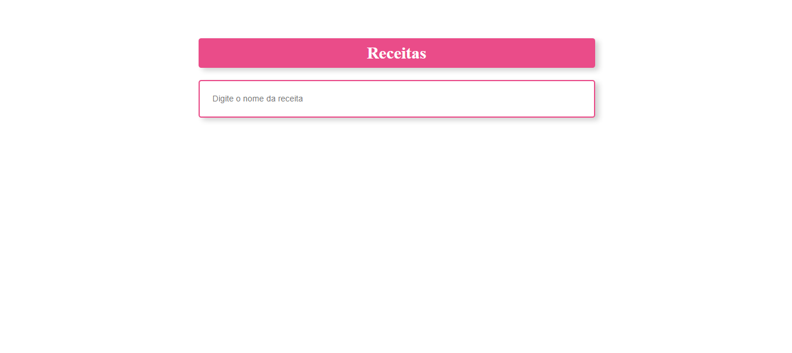
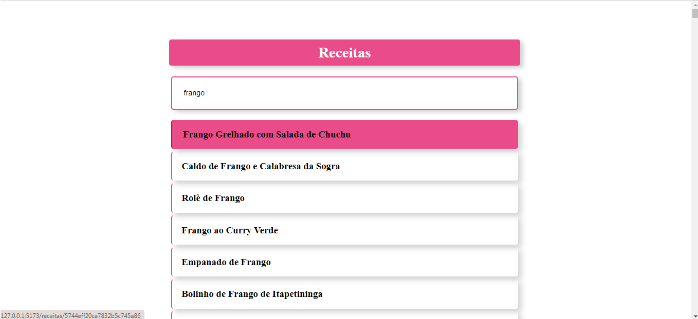
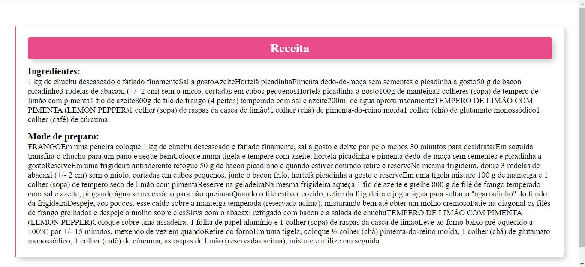

<h1 align="center">Buscando receitas</h1>

# Readme

Pagina desenvolvido para fins de estudo.

<h4>Project in progress...</h4>

# Features
- [x] Consumindo API;
- [x] Busca dinamica;
- [x] React Hooks;
- [x] React State;
- [x] React Router;
- [x] Extraindo parametro da URL;

<h1>
    
</h1>

<h1>
    
</h1>

<h1>
    
</h1>

<h1>
    
</h1>

# Prerequisites
To get started you need to have the [Git](https://git-scm.com/), NodeJS and MongoDB tools installed on your machine. You also need an editor to work with code like [VSCode](https://code.visualstudio.com/).

### Technologies
- HTML
- CSS
- ReactJS
- NodeJS
- TypeScript

---

Made by GUTEMBERG OLIVEIRA. - [See my linkedin.](https://www.linkedin.com/in/gutemberg-oliveira-61a1b1116/)
